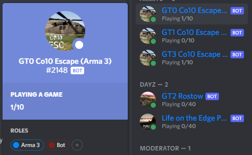

# Discord Player Count Bot

<p align="center">
    
</p>

This is a bot implementation for the Discord API to publish the player count of a game server as the current Activity of
the bot user.

## Installation and usage

There are basically two ways to run and configure this discord bot:

* as a docker container
* as a plain nodejs app

### Start the bot

#### Run as a docker conatiner

The easiest method to install and use this bot is by running it in a docker container. I suggest to use docker-compose
for that, however, starting the container with `docker run` should be fine as well.

```yaml
version: "3"

services:
  serviceName:
    image: droidwiki/discord-player-count
    restart: unless-stopped
    environment:
      DISCORD_TOKEN: YOUR_DISCORD_BOT_TOKEN
      # You need more configuration here, look at the Configuration section
```

You can run as many containers as you want, one container per game server you want to track.

#### Run as a plain nodejs app

You can also clone this repository, build the project on your own and start the resulting JavaScript code directly. You
need to have `nodejs` as well as `npm` installed.

* Clone the repository: `git clone https://github.com/FlorianSW/discord-player-count-bot.git`
* Change to the cloned repository: `cd discord-player-count-bot`
* Build the project: `npm ci && npm run build`
* Start the bot: `DISCORD_TOKEN=YOUR_DISCORD_BOT_TOKEN node dist/index.js`
* Configure the bot with the necessary configuration

### Configure the bot

The bot needs some configuration and supports different sources for the player count, depending on the game server you
want to track. Configuration options are environment variables, which you need to export in the environment where your
app is running. Alternatively, if you run the app as a plain nodejs app, you can also create a `.env` file in the root
directory of the project and set the options there (see the `.env.example` file for an example). You need to set the
following configuration options independently of the selected game status provider.

| Configuration option          | Description | Value  |
| ----------------------------- |-------------| ------:|
| `DISCORD_TOKEN`               | The bot token of your discord app, obtained from https://discord.com/developers/applications -> (Select your application) -> Bot -> Token | `string` |
| `PLAYER_COUNT_PROVIDER`       | The name of the provider you want to fetch player count information from. Currently, two providers are available: `steam` and `battleye`. | `string` |

### Game Status providers

The discord bot uses a game status provider to get the information of currently connected players.
There are two provider available right now: `steam` and `battleye`.

#### Steam

The `steam` provider uses the Steam web api to fetch the player count of the game server.
It depends on the game you want to track if that information is available to steam, but most multiplayer games should provide this information.

You need a Steam Web API token in order to use this provider.
You can create an API key on this web page: https://steamcommunity.com/dev/apikey
When using this provider, the requests made by the Discord bot are counted against the rate limit of this key and you need to agree to the terms of service of Steam.
The provider currently polls for changes, once every 10 seconds.

To configure this provider, set the `PLAYER_COUNT_PROVIDER` configuration option to `steam`, additionally configure the provider with the following options:

| Configuration option          | Description | Value  |
| ----------------------------- |-------------| ------:|
| `STEAM_API_TOKEN`             | Your Steam Web API token to authenticate requests.                                                             | `string` (API token) |
| `GAME_ADDRESS`                | The Game address of your game server (usually the IP address of the server together with the steam query port. | `IPv4:Port`          |

#### BattlEye RCon

The `battleye` provider uses the RCon protocol features provided by games which utilise the BattlEye anti-cheat software.
Only games with BattlEye are supported by this provider, some games may also not work, even given they use BattlEye.
In order to use this provider, you need to set the `RConPort` option in your BattlEye configuration, as well as the RConPassword option.
Both values, together with your game servers IP address need to be configured.

To configure this provider, set the `PLAYER_COUNT_PROVIDER` configuration option to `battleye`, additionally configure the provider with the following options:

| Configuration option          | Description | Value  |
| ----------------------------- |-------------| ------:|
| `BE_RCON_HOST`                | The hostname/IP address of your game server.                                                      | `IPv4` |
| `BE_RCON_PORT`                | The RCon port of your game server.                                                                | `string`          |
| `BE_RCON_PASSWORD`            | The RCon password of your game server.                                                            | `number`          |
| `BE_RCON_MAX_PLAYERS`         | The configured max players of your game server (BattlEye RCon does not provide this information). | `number`          |
